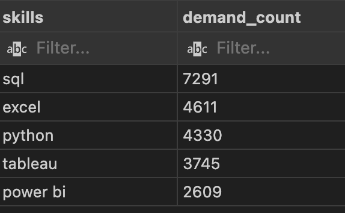
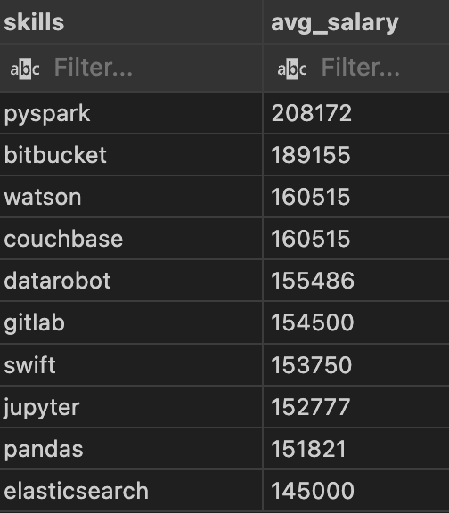
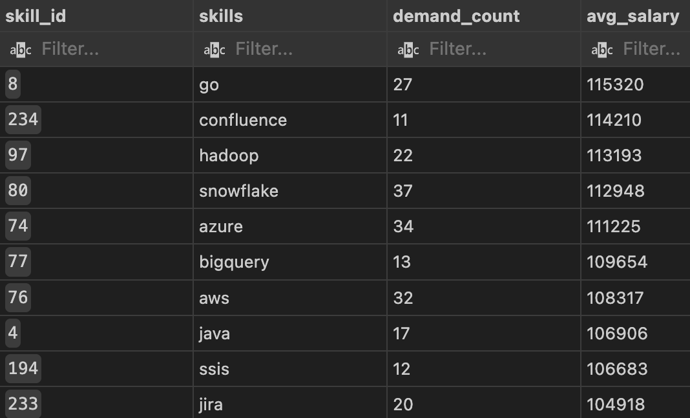

# Introduction
Diving deeper into the data job market! Focusing on data analyst roles, this project explores the top-paying jobs, in-demand skills, and where high demand cmeets high salary in data analytics.

SQL queries? Check them out here: [project_sql folder](/project_sql/)

# Background
Aspiring to become a data analyst, I took it upon myself to learn more about the analyst job market,pinpointing top-paid and in-demand skills, streamlining others work to find optimal jobs.

The data used was from this [SQL Course](https://www.lukebarousse.com/sql)  I took online. 

### Questions I wanted to answer through my SQL queries were:

1. What are the top paying data analyst jobs?
2. What skills are required for these top-paying jobs?
3. What skills are most in demand for data analysts?
4. Which skills are associated with higher salaries?
5. What are the most optimal skills to learn?

# Tools I Used
For my analysis of the data analyst job market, I utilized several key tools:

- **SQL:** The staple for my analysis, allowing me to query the database and identify key insights.
- **PostgreSQL:** The chosen database management system, ideal for handling the kob posting data.
- **Visual Studio Code:** My go_to for database management and executing sql queries.
- **Git and GitHub:** Essential for version control and sharing my SQL scripts and analysis, ensuring collaboration and project tracking.

# The Analysis
Each query for this project aimed at investigating specific aspects of the data analyst job market. Here's how I approached each question:

### 1. Top Paying Data Analyst Jobs
To identify the highest-paying roles I filtered data analyst positions by average yearly salary and location, focusing on remote jobs. This query highlights the high paying opportunities in the field. 

```sql

SELECT
    job_id,
    job_title,
    job_location,
    job_schedule_type,
    salary_year_avg,
    job_posted_date,
    name as company_name

FROM
    job_postings_fact
LEFT JOIN company_dim on job_postings_fact.company_id = company_dim.company_id

WHERE
job_title_short = 'Data Analyst' AND
job_location = 'Anywhere' AND
salary_year_avg is NOT NULL

order by
    salary_year_avg DESC

limit 10
```

Here's the breakdown of the top data analyst jobs in 2023:

- **Wide Salary Range:** Top 10 paying data analyst roles span from $184,000 to $650,000, in dicating significaant slary potential in the field. 
- **Diverse employers:** Companies like SmartAswet, Meta, and AT&T are among those offering high salaries, showing a broad interest across different industries.
- **Job Title Variety:** There's a high diversity in job titles, from Data Analyst to Director of Analytics, reflecting varied roles and specializations within data analytics.

### 2. Skills for Top Paying Jobs
To understand what skills are required for top paying jobs, I joined the job postings with the skills data, providing insights into what employers value for high-compensation roles. 
```sql
WITH top_paying_jobs as (
SELECT
    job_id,
    job_title,
    salary_year_avg,
    name as company_name
FROM
    job_postings_fact
LEFT JOIN company_dim on job_postings_fact.company_id = company_dim.company_id
WHERE
job_title_short = 'Data Analyst' AND
job_location = 'Anywhere' AND
salary_year_avg is NOT NULL
order by
    salary_year_avg DESC
limit 10
)
select 
    top_paying_jobs.*,
    skills
from top_paying_jobs
inner join skills_job_dim on top_paying_jobs.job_id = skills_job_dim.job_id
inner join skills_dim on skills_job_dim.skill_id = skills_dim.skill_id
order by
    salary_year_avg DESC
```
Based on the findings, SQL, Python, and Tableau were the most sought after skills within the top paying Data Analyst roles. 

### 3. In-Demand Skills for Data Analysts**
This query helped identify the skills most frequently requested in job postings, directing focus to areas with high demand.
```sql
select 
skills,
count (skills_job_dim.job_id) as demand_count
from job_postings_fact
inner join skills_job_dim on job_postings_fact.job_id = skills_job_dim.job_id
inner join skills_dim on skills_job_dim.skill_id = skills_dim.skill_id
WHERE
    job_title_short = 'Data Analyst' AND
    job_work_from_home = TRUE
GROUP BY
    skills
ORDER BY 
    demand_count desc
limit 5
```
Here's the breakdown of the most in demand skills for data analysts in 2023:

- **SQL** and **Excel** continue to be the most common skill required, as it is the foundation of data processing and spreadsheet manipulation for many companies.

- **Programming** and **Visualization Tools** like Python, Tableau, and Power BI are also essential, emphasizing the need for technical skills and data visualization for decision making. 

**Top 5 Demanded Skills**



### 4. Skills Based on Salary
Exploring the average salaries associated with different skills revealed which skills are the highest paying

```sql
select 
skills,
round(avg (salary_year_avg), 0) as avg_salary
from job_postings_fact
inner join skills_job_dim on job_postings_fact.job_id = skills_job_dim.job_id
inner join skills_dim on skills_job_dim.skill_id = skills_dim.skill_id
WHERE
    job_title_short = 'Data Analyst' 
    AND salary_year_avg is not null 
    and job_work_from_home = TRUE
GROUP BY
    skills
ORDER BY 
    avg_salary DESC
limit 10
```
Breakdown of skills for top paying skills for Data Anlaysts:
- **High Demand** for **Big Data** & **ML Skills:** Top salaries are commanded by analysts skilled in big data technologies (PySpark, Couchbase), Machine learning tools (DataRobot, Jupyter), and Python libraries (Pandas, Numpy), reflecting the industry's high valuation of data processsing and predictive modeling capabilities.

- **Software Development & Deployment Proficiency:** Knowledge in development and deployment tools (GitLab, Kubernetes,Airflow) indicates a valuable crossover between data analysis and engineering, with a premium on skills that facilitate automation and efficient data pipeline management.

**Top 10 Average Salaries Based on Skills**



### 5. Most Optimal Skills to Learn
Combinig insights from demand and salary data, this query aimed to pinpoint skills that are both in high demand and have high salaries, offering a strategic focus for skill development.

```sql
    select 
    skills_dim.skill_id,
    skills_dim.skills,
    count (skills_job_dim.job_id) as demand_count,
    round (avg(job_postings_fact.salary_year_avg),0) as avg_salary
    from job_postings_fact
    inner join skills_job_dim on job_postings_fact.job_id = skills_job_dim.job_id
    inner join skills_dim on skills_job_dim.skill_id = skills_dim.skill_id
    WHERE
        job_title_short = 'Data Analyst' AND
        salary_year_avg is not null AND
        job_work_from_home = TRUE
    GROUP BY
       skills_dim.skill_id
    HAVING
        count(skills_job_dim.job_id) > 10
order BY
avg_salary DESC,
demand_count DESC
limit 25
```
**Most optimal skills for Data Analyst by salary**


**High-Demand Programming Languages:** Python and R stand as high demand skills, with demand counts of 236 and 148 respectively. Despite this high demand, the average salaries are around $101,000 for Python and $100,000 for R, indicating that proficiency in these languages is in demand but also widely available.

**Cloud Tools and Technologies:** Skills in specialized technologies such as Snowflake, Azure, AWS, and BigQuery show significant demand with relatively high salaries, presenting the growing importance of cloud platforms and big data technologies in data analysis.

**Visualization Tools:** Tableau and Looker contain demand counts of 230 and 49, with average salaries of $99,000 and $103,000, making these tools desirable and highlight the need for high quality visualization and business intelligence to determine business decisions. 

**Database Technologies:** The demand for skills in databases (Oracle, SQL Server, NoSQL) with average salaries ranging from $97,000 to $104,000, explains the need for data storage, retrieval, and management expertise.

# What I Learned
- Navigation and use of SQL from a data analyst perspective, being able to construct complex queries merging tables and utilizing *WITH* clauses to create temporary tables.
- Aggregating data with the *GROUP BY, COUNT(), and AVG()* functions. 
- Improved and utilized my analytical skills by answering questions using insightful SQL queries and analysis. 


# Conclusions
1. **Top-Paying Data Analyst Jobs:** The highest-paying jobs for data analysts that allow remote work offer a wide range of salaries upwards of $650,000.
2. **Skills for Top-Paying Jobs:** High-paying data analyst jobs require advanced proficiency in SQL, suggesting it's a critical skill for earning a top salary.
3. **Most In-Demand Skills:** SQL is also the most demanded skill in the data analyst job market, making it essential for job seekers.
4. **Skills with Higher Salaries:** Specialized skills, such as SVN and Solidarity, are associated with the highest average salaries, indicating a connection of niche experience to high pay.
5. **Optimal Skills for Job Market Value:** SQL leads in demand and offers for a high average salary, positioning it as one of the most optimal skills to learn for data analysts to maximize their market value.

# Closing Thoughts
With this project I was able to expand my SQL skills greatly and gain insights on the data analyst job market. Through the analysis it was determined that prioritizing skill development and job search efforts are necessary to identify ideal positions. Aspiring data analysts can utilize this project to understand the skills that have the most demand and produce the highest salaries. The importance of continous learning and adapting to new technologies and systems is what will propel one in the field of data analytics.
